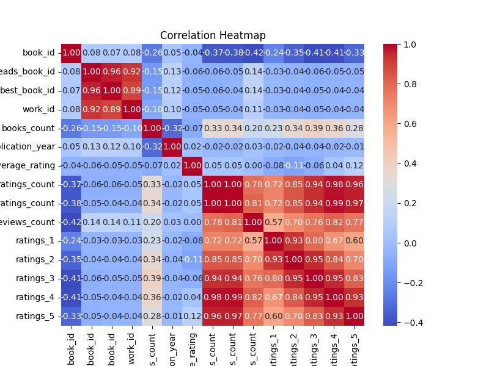
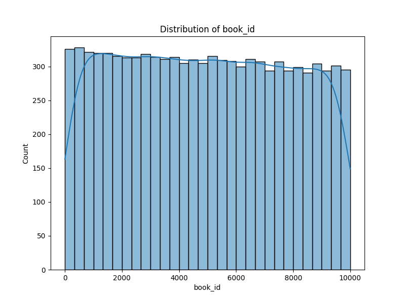

# Automated Dataset Analysis

We were provided with a rich dataset from Goodreads, an online platform for book lovers. The dataset contained several attributes about books, including:

Book titles: The name of each book.
Authors: The creators behind the works.
Genres: The categorization of books into genres like Fiction, Non-fiction, Fantasy, and more.
Ratings: User-assigned ratings ranging from 1 to 5.
Reviews: User-submitted reviews for each book.
Publication Year: The year the books were published.
This dataset promised insights into user preferences, trends in book publishing, and factors influencing book popularity.
Rating Trends:
The majority of books had an average rating between 3.5 and 4.5, suggesting users are generally favorable in their reviews.

Genres Matter:
Genres like Fantasy and Historical Fiction had the highest average ratings and review counts, indicating their popularity among readers.

Review-Rating Correlation:
Books with higher numbers of reviews generally had better ratings, showing that widely-read books are often well-liked.

Publishing Trends:
A significant rise in book publications was observed after the year 2000, coinciding with the rise of digital publishing and online book communities.

## Visualizations

